# Architecture

Evaluation Cascade is a reusable evaluation and regression platform for locally hosted LLM applications. It is an orchestration layer around application adapters, versioned test cases, ordered evaluators, run-level metrics, regression comparison, and release gates. The project is not itself a linguistic benchmark: Cognitive-Eval is one domain integration, alongside structured ticket extraction and test doubles.

## System shape

```mermaid
flowchart LR
        CLI[CLI / python -m evalcascade.run] --> Config[RunConfig\nYAML + CLI overrides]
        Config --> Dataset[Dataset loader]
        Config --> Adapter[Application adapter]
        Dataset --> Cases[EvaluationCase list]
        Cases --> Adapter
        Adapter --> Output[ApplicationOutput]
        Cases --> Cascade[Cascade]
        Output --> Cascade
        Cascade --> CaseResult[CaseResult]
        CaseResult --> Metrics[Aggregate metrics\noverall + slices]
        CaseResult --> Store[(SQLite ResultStore)]
        Metrics --> Store
        Store --> Baseline[Baseline loader]
        Baseline --> Regression[Candidate comparison]
        Metrics --> Gates[Release gates]
        Regression --> Gates
        Gates --> Decision[ReleaseDecision]
        Decision --> Store
        Decision --> Report[JSON + terminal report]
        Store --> Dashboard[Streamlit dashboard]
```



The primary implementation lives in [`evalcascade/`](../evalcascade/). The vendored [`cognitive-eval/`](../cognitive-eval/) tree is an external domain implementation kept separate from the platform core. Versioned inputs live under [`datasets/`](../datasets/), environment and gate policy under [`configs/`](../configs/), and operational run data under [`eval_runs/`](../eval_runs/).

## Main layers

### 1. Command and configuration layer

The normal entry point is [`evalcascade/cli.py`](../evalcascade/cli.py), invoked as either `python -m evalcascade.run` or through the installed CLI entry point. It:

1. Parses dataset, adapter, model, baseline, output, store, and gate-failure options.
2. Calls [`config.py`](../evalcascade/config.py) to load a YAML file and apply command-line overrides.
3. Invokes [`engine.py`](../evalcascade/engine.py) and renders either a JSON document or a terminal summary.
4. Returns exit code `1` only when `fail_on_gate` is enabled and the release decision is `fail`.

`RunConfig` is the typed runtime contract. It contains:

- `AdapterConfig`: adapter name, model, timeout, retry count, temperature, and application version.
- dataset name and optional baseline selector.
- the ordered evaluator names.
- `StatisticalConfig`: FR-6 thresholds and embedding/clustering settings.
- `GateThresholds`: minimum quality, maximum error/latency, and regression tolerances.
- SQLite and optional JSON report paths.

The YAML files are policy presets rather than separate application implementations. [`configs/ci.yaml`](../configs/ci.yaml) uses deterministic mocks and fails CI on critical gates; [`configs/local.yaml`](../configs/local.yaml) selects Ollama and the full Cognitive-Eval dataset; [`configs/extraction.yaml`](../configs/extraction.yaml) selects the extraction adapter and field-specific gates.

### 2. Dataset layer

[`datasets.py`](../evalcascade/datasets.py) resolves a dataset directory under `datasets/` and reads its `manifest.yaml`.

There are two source modes:

- `inline`: load JSON cases and validate each item as an `EvaluationCase`.
- `cognitive`: import Cognitive-Eval's dataset loader lazily, then map each vendored `TestItem` into the platform's `EvaluationCase` shape.

`EvaluationCase` is the input-side contract. It carries an id, prompt text, expected values, tags, severity, arbitrary metadata, and dataset version. Cognitive cases preserve domain information such as lexical condition, language, phenomenon, tier, rule node, verification method, and gold structure in `metadata`; this is what allows the generic cascade to invoke the correct domain verifier without knowing the whole Cognitive-Eval schema.

Dataset manifests therefore control reproducibility and selection. For example, `cognitive-v1` loads all Cognitive-Eval cases, while `smoke-v1` selects five specific case ids from the same source.

### 3. Application adapter layer

The [`ApplicationAdapter`](../evalcascade/adapters/protocol.py) protocol has one required operation:

```text
run(case: EvaluationCase, config: dict) -> ApplicationOutput
```

The adapter boundary isolates how an application is called from how its output is judged. `ApplicationOutput` records status, parsed output, raw text, error text, latency, retry count, and optional token usage. The normalized application statuses are `success`, `timeout`, `runtime_error`, `invalid_response`, and `retry_exhaustion`.

[`adapters/__init__.py`](../evalcascade/adapters/__init__.py) is the factory and currently supports:

- `mock`: deterministic responses for tests and CI.
- `ollama`: calls a locally hosted Ollama model, including timeout and retry handling.
- `cognitive` / `cognitive-ollama`: delegates execution to Ollama while tagging the adapter as Cognitive-Eval.
- `cognitive-mock`: Cognitive-Eval metadata with deterministic mock execution.
- `extraction` / `extraction-mock`: wraps an inner adapter, prepends the extraction prompt, parses JSON, and validates it as a `TicketRecord`.

The Cognitive-Eval adapter is intentionally thin. The structured extraction adapter is a more substantial decorator: it transforms the prompt before execution and transforms raw model text into a typed dictionary before evaluators see it.

### 4. Evaluation model and cascade

The platform data contracts are defined in [`models.py`](../evalcascade/models.py):

- `EvaluationResult`: one evaluator's status, score, category, severity, evidence, version, and timing.
- `CaseResult`: the durable result for one case, including application output, every evaluator result, final status, failure categories, review flag, severity, tags, and input.
- `AggregateMetric`: an overall or sliced run metric.
- `CascadeOutcome`: the merged per-case decision.
- `RunMetadata`, `ComparisonSummary`, `GateResult`, and `ReleaseDecision`: run provenance and release-level outcomes.

[`cascade.py`](../evalcascade/cascade.py) builds the configured evaluator list and runs it in configuration order. Each evaluator receives the case, normalized application output, and results from earlier evaluators. The built-in evaluators are:

| Evaluator | Scope | Responsibility |
| --- | --- | --- |
| `schema` | Per case | Validates JSON/object shape, required fields, allowed values, or extraction parse status. It is `not_applicable` when a case has no schema contract. |
| `cognitive_rule_verifier` | Per case | For Cognitive-Eval cases, selects the natural or novel English forced-choice verifier from case metadata and audits the corresponding rule graph node. |
| `extraction_fields` | Per case | Compares structured ticket fields to expected values, detects critical-field mismatches and hallucinated fields, and computes field accuracy. |
| `llm_judge` | Per case | Model-based judgment against a fixed, disclosed rubric, scoped to cases that opt in via a `judge_rubric` and that no earlier deterministic evaluator already resolved. A judgment below the confidence floor is routed to `review` rather than trusted. |
| `statistical` | Run | Compares candidate and baseline behavior for output length, latency, labels, review rate, error concentration, and optionally embedding clusters. |
| `review_router` | Per case | Routes high-severity failures, evaluator errors, unsupported cases, disagreements, and near-threshold failures to human review. |

`llm_judge` ([`evaluators/llm_judge.py`](../evalcascade/evaluators/llm_judge.py)) is the platform's port of Cognitive-Eval's Cascade Stage 3. It only produces a `pass`/`fail`/`review`/`error` when a case carries `judge_rubric` metadata (or `expected.judge_rubric`) and no prior evaluator in the cascade already returned `pass` or `fail` for that case — otherwise it is `not_applicable`, so the cheapest resolving method always wins over a model judgment. An empty or whitespace-only model output short-circuits to `review` without invoking the judge. The default judge function lazily resolves Cognitive-Eval's Ollama-backed `ollama_judge` through [`vendor.py`](../evalcascade/vendor.py); a different `judge_fn` can be injected at construction for tests or alternate judge backends. Per FR-7, a judgment with `confidence` below `0.6` is routed to `review` rather than trusted outright, so `llm_judge` cannot be the sole release gate on its own.

The deterministic per-case merge uses this precedence:

```text
fail > error > review > pass/not_applicable
```

The deciding evaluator is the highest-ranked result. A review result can set `review_required`, but cannot clear a deterministic failure. Statistical results are calculated after all cases have been executed and are attached to each `CaseResult` for inspection; they can turn an otherwise passing run into a warning, but never turn a failure into a pass.

### 5. Run engine

[`engine.py`](../evalcascade/engine.py) is the application service that coordinates one complete run:

1. Load and validate the dataset.
2. Build the adapter, cascade, store, and evaluator-version map.
3. Create and persist initial `RunMetadata` with git, runtime, model, dataset, evaluator, hardware, and seed information.
4. Execute every `EvaluationCase` through the adapter and per-case cascade.
5. Persist each `CaseResult` immediately through `ResultStore`.
6. Resolve the configured baseline and load its cases and metrics.
7. Run optional run-level statistical checks and attach their signals.
8. Compute overall and sliced metrics.
9. Compare candidate and baseline when both are available.
10. Evaluate release gates, persist the final metadata and decision, and build the report.

The engine owns orchestration, not domain scoring. This keeps the same lifecycle usable for Cognitive-Eval, extraction, and future adapters.

## Metrics, regression, and gates

[`metrics.py`](../evalcascade/metrics.py) computes metrics for the full suite and for slices grouped by severity and case tags. Current metrics include overall accuracy, a bootstrap 95% CI over items, majority-class and random chance baselines when gold letters are available, an exact McNemar test on natural/novel pairs, fail rate, schema validity, application error and timeout rates, review routing, high-severity failure rate, mean/p50/p95 latency, extraction field accuracy, critical-field accuracy, and task completion. Alternate prompt copies are kept out of the headline accuracy and reported as a phrasing gap. Optional repeat sampling adds mean agreement and entropy.

[`regression.py`](../evalcascade/regression.py) compares cases by shared case id and metrics by name. It reports:

- newly failing cases, repaired cases, and all changed outcomes;
- absolute and relative overall metric differences;
- operational differences for errors, timeouts, latency, and review routing;
- slice-level accuracy differences for regression analysis.

[`gates.py`](../evalcascade/gates.py) converts metrics and comparison data into a `ReleaseDecision`. Minimum gates cover schema validity, overall accuracy, and optional critical-field accuracy. Maximum gates cover high-severity failures, application errors, and p95 latency. When a baseline exists, separate gates enforce allowed overall-quality and high-risk-slice drops. Critical gate failures produce `fail`; warnings and review-required outcomes are preserved as distinct release statuses.

## Persistence and reporting

[`store.py`](../evalcascade/store.py) owns the SQLite boundary. The default database is `eval_runs/evalcascade.sqlite`. It creates four tables:

- `evaluation_run`: one JSON payload of `RunMetadata` per run.
- `case_result`: one JSON payload per `(run_id, case_id)`.
- `aggregate_metric`: one JSON payload per metric and optional slice.
- `release_decision`: one JSON payload per run.

The schema deliberately stores validated Pydantic payloads as JSON rather than spreading every model field across columns. SQLite is the source of truth for the dashboard and for a later baseline lookup. `resolve_baseline` accepts a direct run id, a run-id prefix, a dataset version, or a release-style selector.

[`report.py`](../evalcascade/report.py) creates a compact report containing run metadata, overall metrics, slice accuracy, gates, critical failures, statistical evidence, comparison data, and case-level summaries. The same report can be serialized to JSON or rendered as a terminal summary.

The Streamlit application in [`dashboard/app.py`](../dashboard/app.py) reads the SQLite store through [`dashboard/utils.py`](../dashboard/utils.py). It is an investigation surface, not a second evaluation engine: it shows run history, release status, baseline deltas, slice charts, the human-review queue, failed-case evidence, FR-6 results, and provenance. It recomputes a comparison only for the selected candidate/baseline display.

## Cognitive-Eval integration boundary

[`vendor.py`](../evalcascade/vendor.py) defines the vendored root and adds it to `sys.path` only when a Cognitive-Eval dataset, rule evaluator, or embedding check needs it. The platform does not import Cognitive-Eval packages at module import time.

The integration uses four narrow surfaces:

1. Dataset loading imports `src.schema.dataset_loader.load_all_test_items` and maps `TestItem` values into platform cases.
2. Rule scoring imports the rule graph, audit function, and language-specific forced-choice verifiers.
3. FR-6 imports the pure clustering functions `embed_texts`, `cluster_embeddings`, `cluster_quality`, and `summarize_clusters` when embeddings are enabled or supplied.
4. `llm_judge`'s default judge function imports `src.cascade.ollama_judge.ollama_judge` only when a case with `judge_rubric` reaches it and no injected `judge_fn` was supplied at construction.

FR-6 does not run Cognitive-Eval's discovery pipeline and does not write Cognitive-Eval discovery logs. This keeps Evaluation Cascade's SQLite results as the platform source of truth while reusing domain algorithms where useful. It also prevents optional NLP dependencies from becoming import-time requirements for mock or extraction runs.

## End-to-end workflows

### CI smoke run

```text
configs/ci.yaml
    -> smoke-v1 manifest
    -> cognitive cases mapped from the vendored dataset
    -> mock adapter responses
    -> schema/rule/review evaluators
    -> metrics and critical gates
    -> SQLite + terminal output
```

The smoke command does not require a GPU or Ollama:

```bash
python -m evalcascade.run --config configs/ci.yaml --dataset smoke-v1 --adapter mock --fail-on-gate
```

### Local Cognitive-Eval run

`configs/local.yaml` selects Ollama, `cognitive-v1`, and `llm_judge` so quantifier-scope justification items reach Stage 3. The adapter returns raw model text; the rule-graph evaluator applies the language-specific verifier selected by each case's metadata, and returns not-applicable when the case carries a judge rubric instead. Optional baseline and embedding checks add run-level evidence. Set `consistency_repeats` above 1 with a nonzero temperature to majority-vote repeated samples.

### Structured extraction run

`configs/extraction.yaml` selects `extraction-mock` or can be changed to `extraction`. The decorator parses model output into a `TicketRecord`, then schema and field evaluators separately measure structural validity and field correctness. This separation allows a structurally valid response with incorrect critical fields to fail the appropriate gate.

### Portfolio demonstration

[`scripts/portfolio_demo.py`](../scripts/portfolio_demo.py) creates a baseline, an improvement, and a deliberate regression in the same SQLite store. The regression demonstrates why aggregate schema validity alone is insufficient: a run can improve one metric while critical-field accuracy drops and the release gate fails.

## Testing and extension points

The test suite mirrors the architecture: adapter and extraction behavior, dataset loading, evaluator precedence, metrics/gates, statistical checks, persistence, CLI behavior, dashboard utilities, and the portfolio workflow are covered under [`tests/`](../tests/).

To add a new application integration:

1. Implement `ApplicationAdapter.run` and return a complete `ApplicationOutput` for success and failure paths.
2. Add adapter construction in `adapters/__init__.py`.
3. Add a dataset manifest and cases whose metadata describes any domain contract.
4. Reuse existing evaluators where possible; otherwise implement the `Evaluator` protocol and register it in `build_cascade`.
5. Add gate/metric policy to a config file and tests for the new adapter/evaluator boundary.

The stable architectural rule is that application invocation, case evaluation, run aggregation, and release policy remain separate. New domains should plug into those contracts rather than coupling the engine to domain-specific code.
